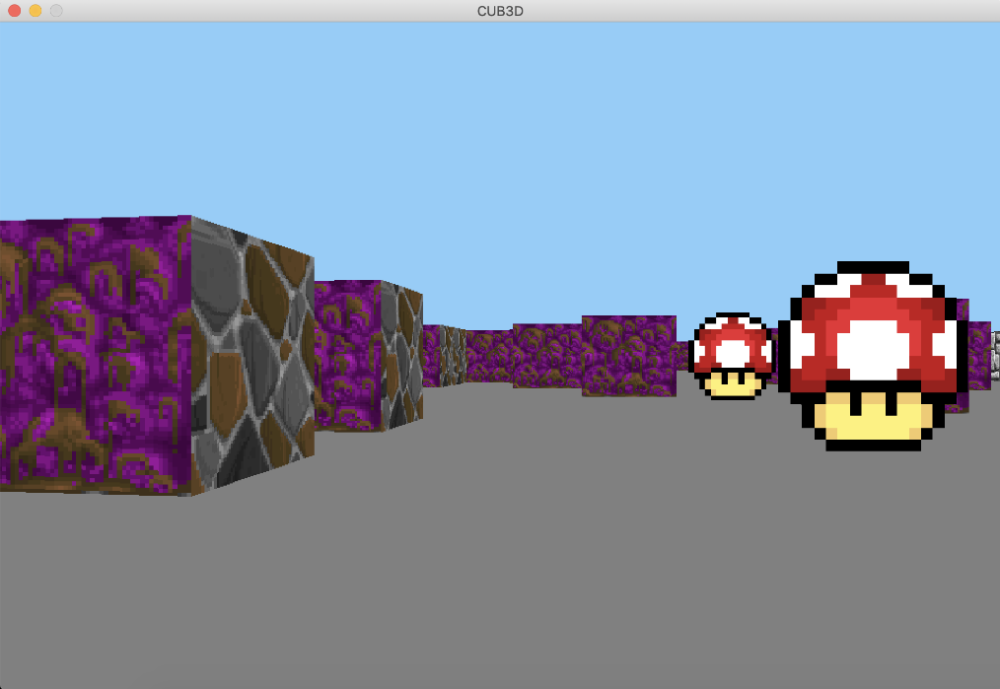

# cub3d

The goal of cub3d is to create a raycasting game similiar to Wolfenstein 3D, with only a limited graphics library.

* WASD to move
* ESC to quit
* Different textures for each direction a wall is facing
* Different colors for the sky and ceiling
* Sprites
